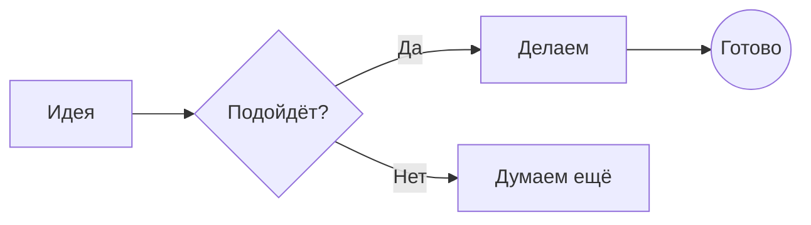
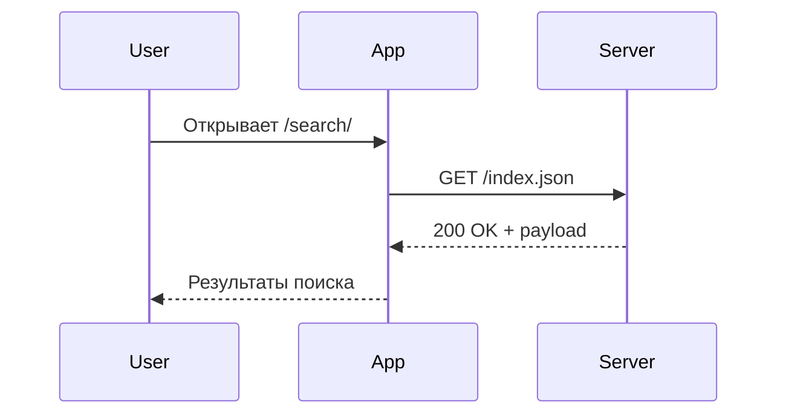

## Mermaid

Простой flowchart:

Sequence diagram:

## Math

Формула Эйлера inline: $e^{i\pi} + 1 = 0$.

Полный display:

$$
\int_{-\infty}^{\infty} e^{-x^2} \, dx = \sqrt{\pi}
$$

Матрица:

$$
\begin{bmatrix}
a & b \\
c & d
\end{bmatrix}^{-1}
=
\frac{1}{ad-bc}
\begin{bmatrix}
d & -b \\
-c & a
\end{bmatrix}
$$
